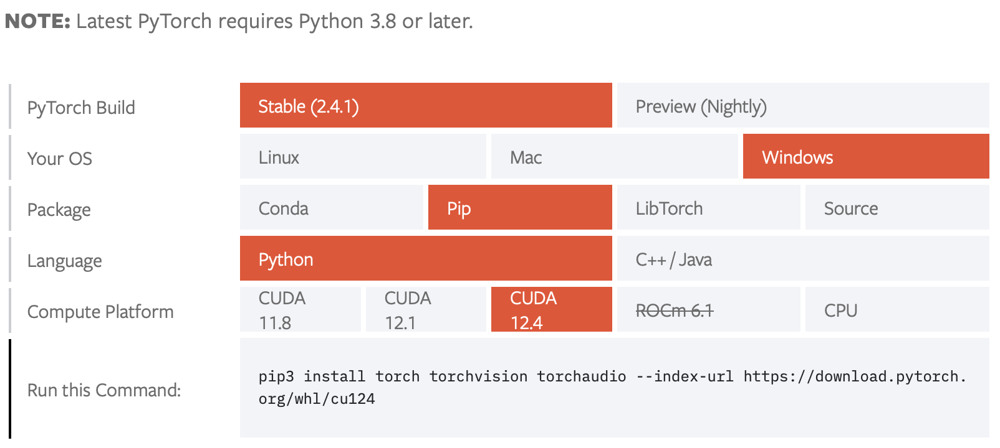
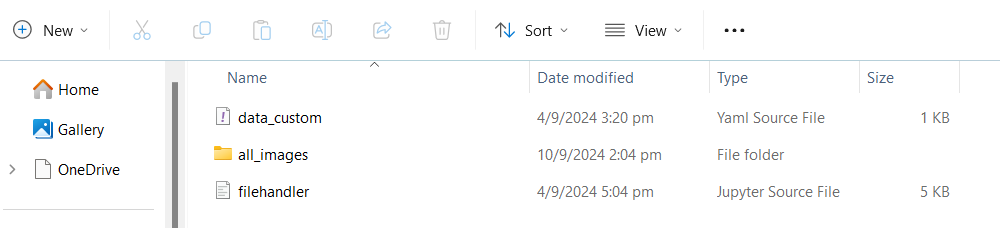
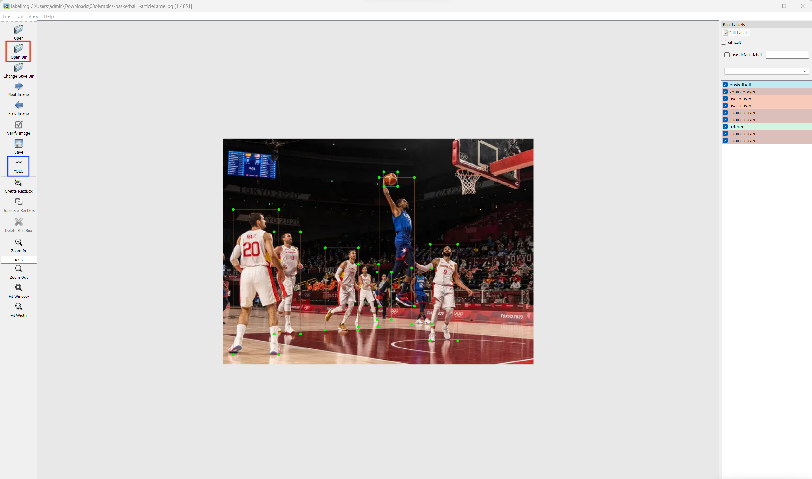
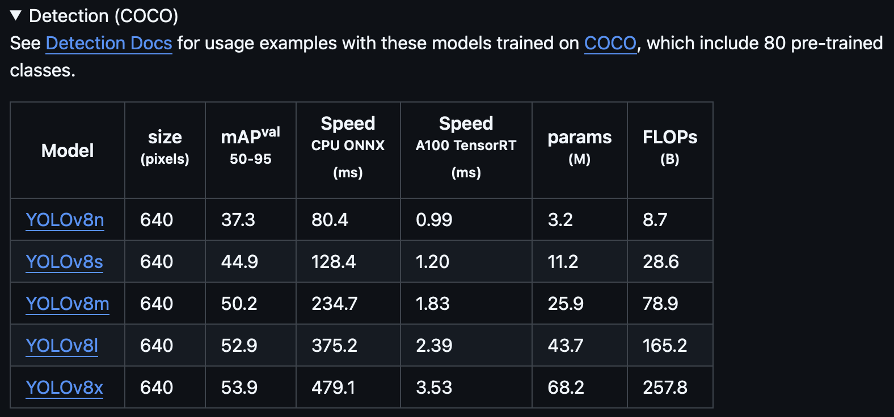

# Yolo v8 Object Detectiom

## Introduction
Short tutorial on how to set up and run Yolo v8 model for object detection on a custom dataset 

## Setting Up 
### For windows and linux users 
1. Create anaconda environment using anaconda prompt
    ```
    conda create -n yolov8od python=3.8
    ```
    yolov8od is the name of your environment, which can be changed, and I will be using python version 3.8 for this example. As of 09/24, python versions 3.8 and later are supported

2. Activate anaconda environment 
    ```
    conda activate yolov8od
    ```

3. Install LabelImg to label images 
    ```
    pip install labelImg
    ```

4. Install Ultralytics 
    ```
    pip install ultralytics 
    ```
    This installs the CPU version of PyTorch, which might make the training process slow, especially on large datasets 

5. Install PyTorch-GPU 
    
    Head over to [PyTorch website](https://pytorch.org/get-started/locally/), and scroll down until you reach this table:
    
    Choose your OS, package (usually either conda or pip), language (for this we are using python), and CUDA version (). Copy and paste the command generated into your anaconda prompt. You can verify the installation by running the following command: 
    ```
    python -c "import torch; device = torch.device('cuda' if torch.cuda.is_available() else 'cpu'); print(f'Using device: {device}')"
    ```
    If GPU is available and recognised, it will print: "Using device: cuda". Else it will print: "Using device: cpu"

## Table of Contents
- [Introduction](#introduction)   
- [Setting Up](#setting-up)   
    - [For Windows / Linux users](#for-windows-and-linux-users)
    - For Mac users 
- [Object Detection ](#object-detection)
- How it works 


## Object Detection
For this example I will be running it on a Windows laptop 
1. Creating file structure
    
    Set up a new folder in this manner:
    
    You can find the data_custom.yaml and filehandler.py files inside this repository as well. Inside the all_images folder, it should contain all of the images that you intend to use for training and testing

2. Annotating Images

    In anaconda prompt type in ```labelimg.exe``` to open up LabelImg: 
    
    - Click on Open Dir (red box), and navigate to all_images folder 
    - Ensure that it is on YOLO mode (blue box). If it is not, click to change it
    - Press "w" to start labelling, then drag the cursor until the object is within the bounding box. Make it as close as possible 
    - Type in your label for the boxes. In this example, I have 4 labels: basketball, spain_player, usa_player and referee. Take note of these labels. 
    - Once you are done with all images, you can close LabelImg and check if every image has a corresponding .txt file 

3. Splitting imgaes into train and test set 

    Ensure that in the all_images folder, there is also a classes.txt file. It should look something like this: 
    
    Take note of the order in which the label names are in.
    Run this command to split the images and labels into their respective train and test folders, with an 80% random split:
    ```
    python filehandler.py
    ```

4. Setting custom labels 

    Navigate into the data_custom.yaml file. Copy both the train and test folders as path, and paste them at their respective places. Train to train, Test to val. Change the number of classes. Here, mine would be 4, since I have 4 labels. Change the names to your label names. The order should be the same as that in the classes.txt file

5. Choosing Yolo V8 detection model 

    Head over to [Ultralytics Github repository](), and scroll down untl you see the detection model table: 
    
    The table is arranged according to model size, the smallest (fastest but least accurate) being at the top, and the largest (slowest but most accurate) being at the bottom. For this example I will be going with the medium model, YOLOV8m

6. Training the Yolo v8 model on a custom dataset

    Run this command:
    ```
    yolo task=detect mode=train epoch=100 data=data_custom.yaml model=yolov8m.pt imgsz=640 batch=8
    ```


